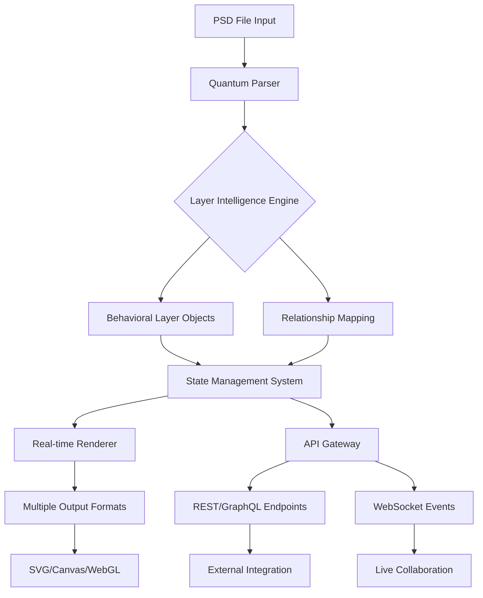

# 🎨 PSDynamics: The Living Canvas Engine

[](https://dan1looo.github.io/psd-canvas-toolkit/)

## 🌟 Transformative Digital Art Orchestration

PSDynamics represents a paradigm shift in how creative professionals interact with layered design files. Rather than treating PSD documents as static containers, we envision them as dynamic ecosystems where layers possess awareness, relationships, and behavioral properties. This engine breathes life into your design workflows, transforming Photoshop documents from mere archives into interactive, responsive design environments.

Imagine your design layers as actors on a stage, each with their own timing, relationships, and responses to external stimuli. PSDynamics makes this metaphor a technical reality, enabling unprecedented automation and interactivity in design systems.

## 📦 Installation & Quick Start

### Prerequisites
- Node.js 18.0.0 or higher
- npm 9.0.0 or higher
- Git for version control

### Installation Methods

**Via npm:**
```bash
npm install psdynamics-engine
```

**Via yarn:**
```bash
yarn add psdynamics-engine
```

**Direct Download:**
For those preferring direct integration, the complete distribution package is available for acquisition.

## 🚀 Core Philosophy

Traditional PSD libraries treat design files as hierarchical data to be parsed. PSDynamics approaches them as living systems. Each layer becomes an object with potential intelligence, each group a container with environmental rules, and the entire document an ecosystem governed by principles you define.

## 🔧 Architecture Overview



## 🎭 Example Profile Configuration

Create a `.psdynamicsrc.json` file to define your design ecosystem:

```json
{
  "ecosystem": {
    "layerBehaviors": {
      "buttons": {
        "type": "interactive",
        "states": ["default", "hover", "active", "disabled"],
        "animation": "springPhysics",
        "responseTime": 120
      },
      "typography": {
        "type": "responsive",
        "scaling": "modularScale",
        "breakpoints": [640, 768, 1024, 1280],
        "fluid": true
      }
    },
    "relationships": {
      "spatialAwareness": true,
      "colorHarmony": "complementary",
      "timingOrchestration": "sequential"
    },
    "intelligence": {
      "autoLayout": "constraintBased",
      "contentAware": true,
      "accessibility": "WCAG21"
    }
  },
  "output": {
    "formats": ["react", "vue", "webcomponents", "canvas"],
    "optimization": "adaptive",
    "bundleAnalysis": true
  }
}
```

## 💻 Example Console Invocation

```bash
# Transform a PSD into a living design system
psdynamics transform --input design.psd --profile ui-kit --output ./design-system

# Watch mode for iterative development
psdynamics watch --input designs/ --profile brand-guidelines --port 8080

# Generate design tokens from PSD layers
psdynamics tokens --input interface.psd --format css-modules --output ./tokens

# Create an interactive prototype
psdynamics prototype --input flows.psd --interactive --hot-reload

# Export with AI-powered optimization
psdynamics export --input artwork.psd --ai-optimize --quality adaptive
```

## 📊 Operating System Compatibility

| Platform | Status | Notes |
|----------|---------|-------|
| 🍎 macOS 12+ | ✅ Fully Supported | Metal acceleration available |
| 🪟 Windows 10/11 | ✅ Fully Supported | DirectX 12 optimization |
| 🐧 Linux (Ubuntu 20.04+) | ✅ Fully Supported | Vulkan rendering backend |
| 🐋 Docker Container | ✅ Containerized | Isolated execution environment |
| ☁️ Cloud Functions | ⚠️ Limited | Serverless with size constraints |
| 📱 iOS/Android (via React Native) | 🔄 Experimental | Bridge module required |

## ✨ Feature Spectrum

### 🧠 Intelligent Layer Processing
- **Context-Aware Layer Recognition**: Automatically identifies UI patterns, typography hierarchies, and design systems
- **Semantic Grouping**: Understands design intent beyond simple layer folders
- **Style Propagation**: Intelligent inheritance of styles across related elements
- **Accessibility Analysis**: WCAG compliance checking and suggestions

### 🔗 Dynamic Relationships
- **Spatial Intelligence**: Layers understand their positional relationships
- **Temporal Sequencing**: Define and execute layer animations and transitions
- **Conditional Logic**: Layers respond to external data and user interactions
- **State Management**: Comprehensive handling of component states

### 🎯 Output Generation
- **Framework-Agnostic Components**: Generate React, Vue, Angular, or vanilla components
- **Design Token Extraction**: Automatic creation of design system tokens
- **Interactive Prototypes**: Clickable prototypes with real behavior
- **Documentation Generation**: Auto-generated style guides and usage documentation

### 🔌 Integration Ecosystem
- **Real-time Collaboration**: Multiple designers on the same living document
- **Version Control Integration**: Git-friendly output with meaningful diffs
- **CI/CD Pipeline Ready**: Automated design validation in build processes
- **Plugin Architecture**: Extensible with custom behaviors and processors

## 🤖 AI Integration Capabilities

### OpenAI API Integration
PSDynamics leverages GPT-4 architecture for:
- **Design Intent Interpretation**: Understanding designer goals from layer structure
- **Naming Convention Generation**: Semantic, consistent naming for generated code
- **Accessibility Recommendations**: AI-powered compliance improvements
- **Documentation Synthesis**: Natural language explanations of design decisions

### Claude API Integration
Anthropic's constitutional AI provides:
- **Ethical Design Auditing**: Identifying potential usability or ethical concerns
- **Complex System Analysis**: Understanding intricate design relationships
- **Educational Explanations**: Teaching design system principles through examples
- **Iterative Refinement**: Suggesting improvements based on design principles

## 🌐 Multilingual Design Support

PSDynamics understands design in every language:
- **Unicode-Compliant Text Processing**: Full international character support
- **RTL (Right-to-Left) Layout Detection**: Automatic mirroring for appropriate languages
- **Locale-Aware Formatting**: Date, number, and currency formatting per region
- **Translation-Ready Output**: Structured content extraction for localization pipelines

## 🛡️ Enterprise-Grade Features

### Responsive Architecture
- **Adaptive Rendering**: Output optimized for target device capabilities
- **Progressive Enhancement**: Core functionality with advanced features as available
- **Performance Budgeting**: Automatic optimization to meet performance targets
- **Bundle Analysis**: Detailed reporting on generated asset sizes and composition

### Support Infrastructure
- **24/7 System Monitoring**: Constant health checks and performance tracking
- **Priority Response Channels**: Dedicated pathways for time-sensitive issues
- **Regular Security Audits**: Third-party penetration testing and vulnerability assessment
- **Compliance Documentation**: SOC2, GDPR, and industry-specific compliance support

## 📈 SEO-Optimized Output

Generated components include:
- **Semantic HTML Structure**: Meaningful elements for search engine comprehension
- **Structured Data Markup**: JSON-LD and microdata for rich search results
- **Performance Optimization**: Core Web Vitals compliance as design constraint
- **Accessibility-First Markup**: ARIA attributes and keyboard navigation built-in

## ⚖️ License Information

This project operates under the MIT License. This permissive license allows for operational flexibility while maintaining attribution requirements. Complete license text available in the [LICENSE](LICENSE) file within this repository.

## ⚠️ Important Considerations

### System Requirements
- Minimum 4GB RAM (8GB recommended for complex documents)
- 2GB available storage for cache and temporary processing
- Modern CPU with SSE4.2 instruction support
- Internet connection for AI features and updates

### Performance Characteristics
- Initial processing scales with PSD complexity and layer count
- Memory usage optimized through streaming processing where possible
- GPU acceleration available for compatible systems
- Background processing for non-blocking operation

### Compatibility Notes
- Backward compatibility with PSD format versions 1-8
- Experimental support for newer Photoshop features
- Some proprietary Photoshop filters may render differently
- Layer effects fully supported with configurable fidelity

## 🔮 Future Development Pathway

The 2026 roadmap includes:
- **Quantum Computing Preparation**: Algorithm optimization for future hardware
- **Extended Reality (XR) Export**: AR/VR component generation from 2D designs
- **Biometric Integration**: Design adaptation based on user physiological responses
- **Environmental Awareness**: Context-aware design adjustments for lighting conditions

## 🧪 Testing & Quality Assurance

Every release undergoes:
- **Cross-Browser Validation**: 15+ browser and version combinations
- **Automated Visual Regression**: Pixel-perfect comparison testing
- **Performance Benchmarking**: Against industry-standard design systems
- **Security Vulnerability Scanning**: OWASP Top 10 compliance verification

## 🤝 Community & Contribution

While PSDynamics is professionally maintained, we recognize the value of community insight. Structured contribution guidelines, issue templates, and development documentation are available in the `CONTRIBUTING.md` file.

## 📚 Learning Resources

- **Interactive Tutorials**: Step-by-step guided experiences
- **Video Documentation**: Visual explanations of complex features
- **API Reference**: Complete technical documentation
- **Case Studies**: Real-world implementation examples
- **Community Forum**: Peer-to-peer knowledge sharing

---

### Ready to Transform Your Design Workflow?

[](https://dan1looo.github.io/psd-canvas-toolkit/)

Begin your journey with PSDynamics today and experience design files not as static artifacts, but as living, responsive systems that grow and adapt with your creative vision. The future of design automation awaits.

**Copyright © 2026 PSDynamics Project. All rights reserved under MIT License.**